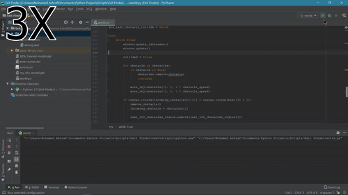

# Exit-Finder

A small python game that plays it self. Your job is to make its life misreable and train it to ace all the obstacles. 
The box has to make its way through obstacles with random opening place.
This training part in the game is done by by [Flexible Neural Network](https://github.com/Mohamed-512/Flexible_Neural_Net),
where you can not only tweak the game rules but also the [FNN](https://github.com/Mohamed-512/Flexible_Neural_Net)'s Hyper parameters.

### 82% Trained Model

A pre trained model is included in this repo, feel free to use it. It saw about 900 obstacles to reach 82% accuracy with a fair learning curve.

